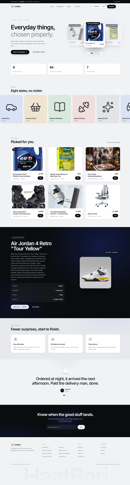
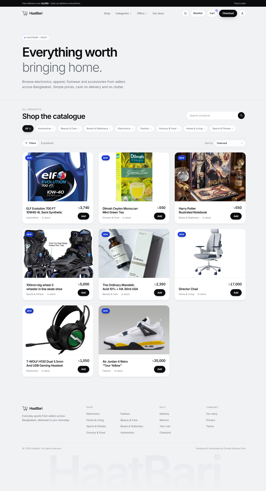
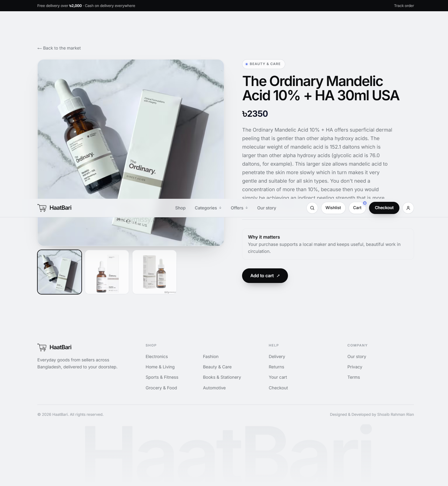
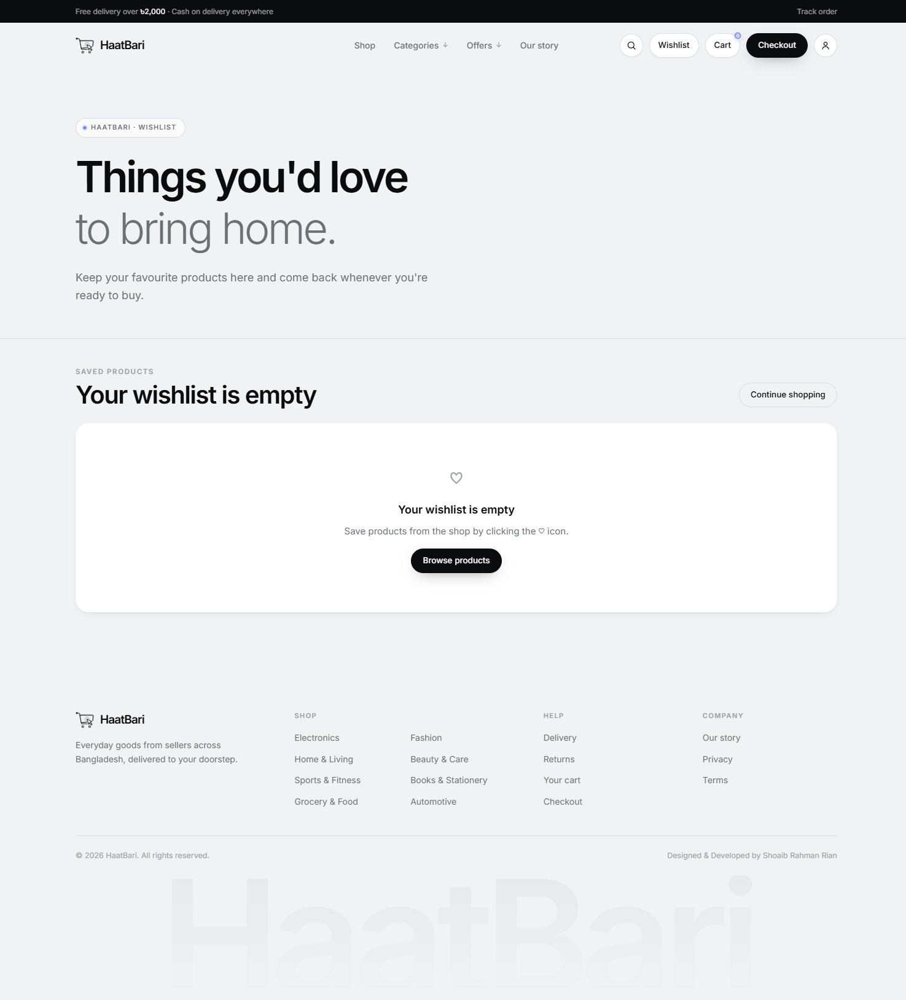
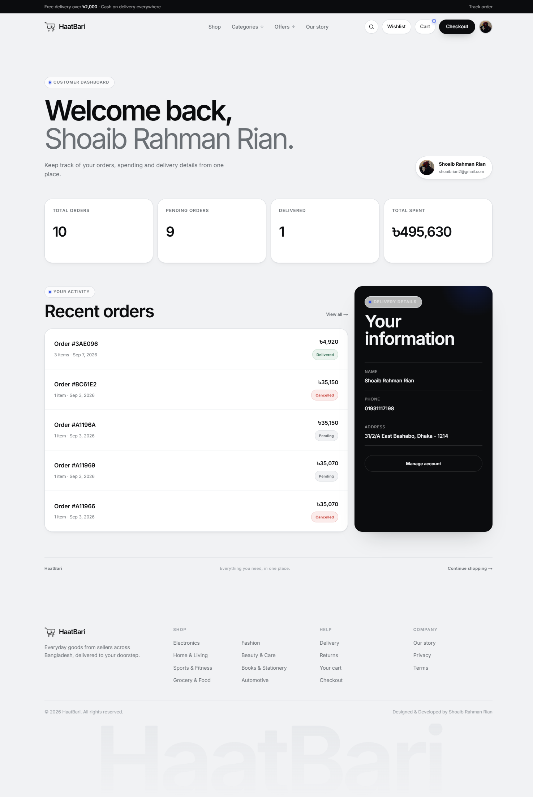
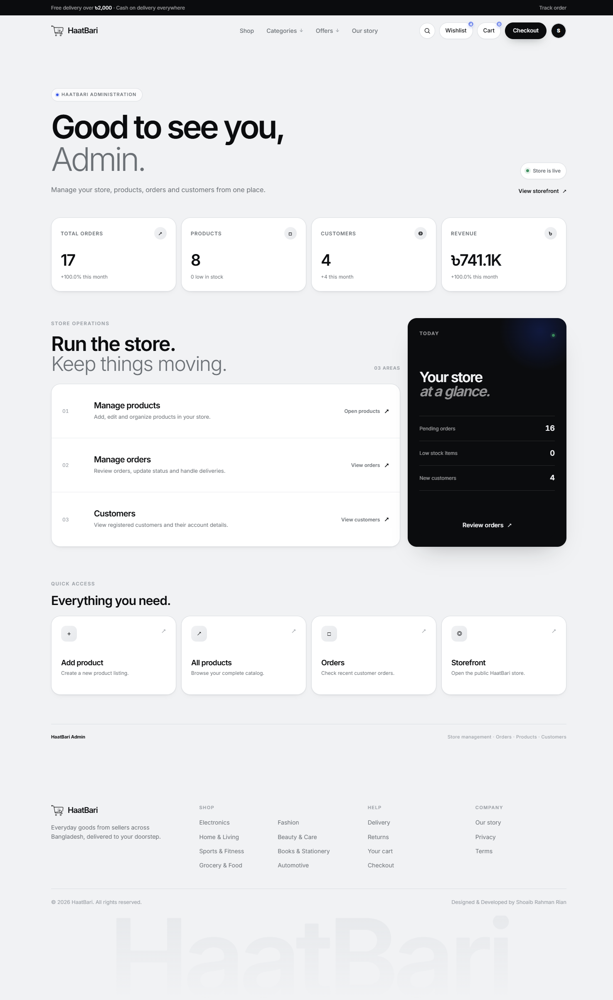

# 🛍️ HaatBari

### Modern Full-Stack E-Commerce Platform

HaatBari is a modern full-stack e-commerce platform built with **Next.js**, focused on delivering a seamless, responsive, and engaging online shopping experience.

The platform combines a modern customer-facing storefront with a dedicated admin system, secure authentication, database-driven product management, cloud-based media handling, order management, wishlist functionality, and **AI-powered product search**.

---

## ✨ Features

### 🛒 E-Commerce

- Modern product browsing experience
- Product categories and filtering
- Product search
- **AI-powered product search**
- Detailed product pages
- Shopping cart
- Wishlist
- Guest wishlist support
- Customer wishlist synchronization
- Checkout and order placement
- Order history and order details
- Fully responsive interface

### 👤 Customer Experience

- Secure authentication with Clerk
- Customer dashboard
- Account management
- Protected customer routes
- Wishlist management
- Order management
- Responsive mobile experience

### ❤️ Smart Wishlist

HaatBari provides wishlist functionality for both guest and authenticated users.

- Guest wishlist is stored locally in the browser
- Wishlist count updates dynamically
- Wishlist persists across navigation
- Guest wishlist automatically synchronizes after login
- Existing customer wishlist items are preserved
- Duplicate wishlist items are prevented

### 👨‍💼 Admin Dashboard

The platform includes a dedicated administration system for managing the e-commerce platform.

- Dashboard statistics
- Customer management
- Product management
- Create and update products
- Delete products
- Product search
- Product image uploads
- Administrative controls

### 📦 Order Management

- Order creation
- Customer order history
- Individual order details
- Protected order operations
- Admin order management

### ☁️ Cloud Media

Product images are managed through **Cloudinary**, providing cloud-based storage and optimized media delivery.

---

## 🧠 AI-Powered Search

HaatBari integrates AI into its product search experience to make product discovery more flexible and intuitive.

The search system processes user queries and helps identify relevant search terms before retrieving matching products from the database.

```text
User Query
     ↓
AI Processing
     ↓
Search Understanding
     ↓
Product Search
     ↓
MongoDB
     ↓
Relevant Products
```

---

## 🏗️ Architecture

HaatBari uses the **Next.js App Router** for both the frontend and backend functionality.

Backend operations are implemented through **Next.js Route Handlers**, with MongoDB accessed through Mongoose.

```text
┌──────────────────────────────┐
│       Next.js Frontend       │
│       React + Tailwind       │
└───────────────┬──────────────┘
                │
                ▼
┌──────────────────────────────┐
│    Next.js Route Handlers    │
│           /app/api           │
└───────────────┬──────────────┘
                │
        ┌───────┴────────┐
        ▼                ▼
┌──────────────┐  ┌──────────────┐
│   Mongoose   │  │    Clerk     │
│              │  │     Auth     │
└──────┬───────┘  └──────────────┘
       │
       ▼
┌──────────────┐
│   MongoDB    │
└──────────────┘

        +

┌──────────────┐
│  Cloudinary  │
│    Media     │
└──────────────┘
```

---

## 🛠️ Tech Stack

| Category           | Technologies                         |
| ------------------ | ------------------------------------ |
| **Frontend**       | Next.js 16, React 19, Tailwind CSS 4 |
| **UI & Animation** | Motion, Lucide React                 |
| **Backend**        | Next.js App Router, Route Handlers   |
| **Runtime**        | Node.js                              |
| **Database**       | MongoDB, Mongoose                    |
| **Authentication** | Clerk                                |
| **Media Storage**  | Cloudinary                           |
| **AI**             | AI-powered product search            |
| **Validation**     | Zod                                  |
| **Development**    | ESLint, Git, GitHub                  |

---

## 📸 Screenshots

### Home



### Shop



### Product Details



### Wishlist



### Customer Dashboard



### Admin Dashboard



---

## 🎯 Project Highlights

HaatBari demonstrates a practical full-stack e-commerce architecture with:

- Modern Next.js App Router architecture
- Full-stack development within a single Next.js application
- REST-style API Route Handlers
- MongoDB database integration with Mongoose
- Secure authentication and authorization
- Customer and admin role management
- Guest-to-user wishlist synchronization
- Cloud-based image management
- AI-assisted product search
- Responsive and interactive UI
- Customer and administrative workflows

---

## 🔮 Future Improvements

- Online payment gateway integration
- Product reviews and ratings
- Personalized product recommendations
- Advanced inventory management
- Real-time order tracking
- Coupon and discount system
- Product comparison
- AI shopping assistant
- Advanced sales and customer analytics

---

## 👨‍💻 Author

### Shoaib Rahman Rian

**Full-Stack Web Developer**

[GitHub](https://github.com/shoaibrrian) · [Portfolio](https://shoaibrahmanrian.vercel.app)

---

## 📄 License

This project is developed as a personal/academic project.

© 2026 HaatBari. All rights reserved.
